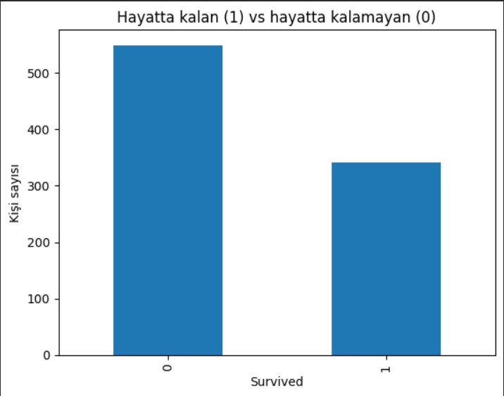

# 🚢 Titanic Mini Data Analysis | Kübra Çağlayan Özkan

Bu repo, veri bilimine giriş yolculuğumda hazırladığım ilk mini projeyi içermektedir.  
Amaç, Titanic veri seti ile temel **EDA (Exploratory Data Analysis)** yapmak, veriyi temizlemek ve **Logistic Regression** ile basit bir sınıflandırma modeli kurmak.

---

## 📊 Projede neler yaptım?

- Titanic veri setini Google Colab üzerinden içe aktardım  
- Sütun türlerini ve eksik değerleri inceledim (`info()`, `describe()`)  
- Modelde kullanmak için sade bir çalışma tablosu oluşturdum  
  - Seçilen değişkenler: `Pclass`, `Sex`, `Age`, `Fare`  
  - `Sex` değişkenini sayısala dönüştürdüm (female=0, male=1)  
  - Eksik `Age` değerlerini ortalama ile doldurdum (baseline yaklaşım)  
- Basit görselleştirmeler yaptım  
  - Hayatta kalan/kalamayan kişi sayıları (bar chart)  
  - Yolcu sınıfına göre hayatta kalma oranları  
- Logistic Regression modeli kurdum  
  - Train/Test ayrımı (80/20)  
  - Modeli eğittim ve **accuracy** skorunu hesapladım  

---

## 📁 Proje dosyası

Ana çalışma dosyam Colab not defteri formatındadır:

- `01_titanic_basic_analysis.ipynb`

Not defterinde:

1. Proje açıklaması (giriş)  
2. Veri yükleme ve inceleme  
3. Veri temizleme ve özellik mühendisliği  
4. Basit görselleştirme adımları  
5. Logistic Regression modeli ve accuracy çıktısı  
6. “Sonuç & Neler Öğrendim” bölümü  

---
> Basit Logistic Regression modelim, test verisi üzerinde yaklaşık **%79 doğruluk (accuracy ≈ 0.79)** elde etti.  
Bu skor, amacım “mükemmel model” kurmak olmasa da, başlangıç seviyesi bir çalışma için tatmin edici bir referans noktası sağladı.

## Neler Öğrendim: 

Bu proje ile:

- Pandas ile veri okuma ve veri çerçevesi üzerinde çalışmayı  
- Eksik verileri tespit etmeyi ve doldurmayı  
- Matplotlib ile temel grafikler çizmeyi  
- Train/Test ayırma mantığını  
- Logistic Regression ile basit bir sınıflandırma modeli kurmayı  
- Model başarımını accuracy metriği ile değerlendirmeyi  

uygulamalı olarak deneyimledim.

Bu repo, **AI & Data öğrenme yolculuğumda attığım ilk gerçek adımlardan biri** olarak portföyümde yer almaktadır. 🚀

---

## 🛠 Kullanılan teknolojiler

- Python  
- Pandas  
- NumPy  
- Matplotlib  
- Scikit-Learn  
- Google Colab  

---

## İletişim Bilgilerim

- GitHub: [@Cagiband](https://github.com/Cagiband)  
- LinkedIn: [cagiband](https://www.linkedin.com/in/cagiband/)
